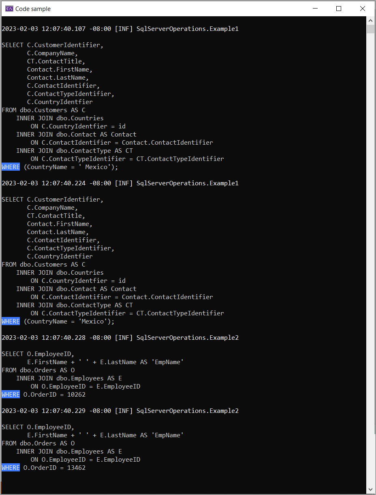

# Reveal Data provider parameter values at run time

## Base requirements

- Microsoft Visual Studio 2022

## DbPeekQueryLibrary

- No NuGet packages
- .NET Core 7

## DbPeekQueryLibrary (NuGet) package

[DbPeekQueryLibrary](https://www.nuget.org/packages/DbPeekQueryLibrary/)

## Demo project requires

- Serilog NuGet package
- Serilog.Sinks.Console
- Serilog.Extensions.Logging.File
- Serilog.Sinks.File
